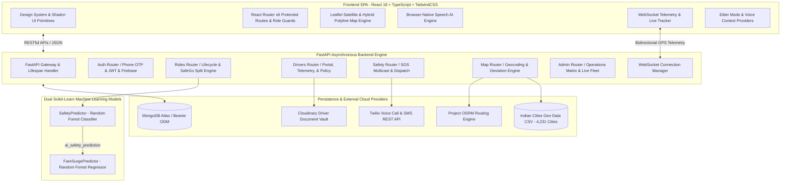
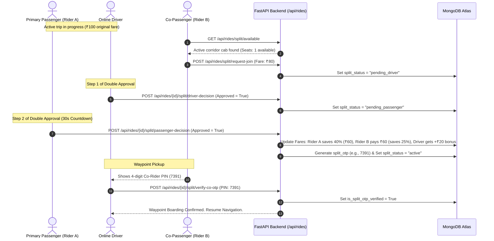
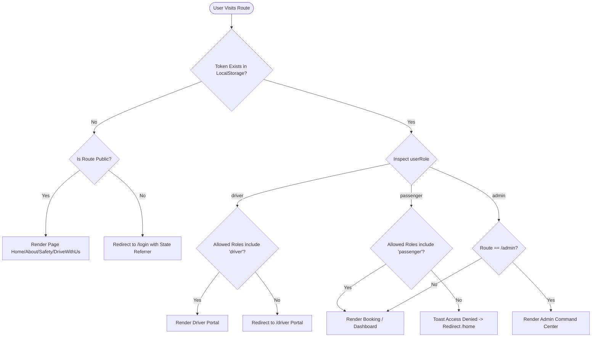
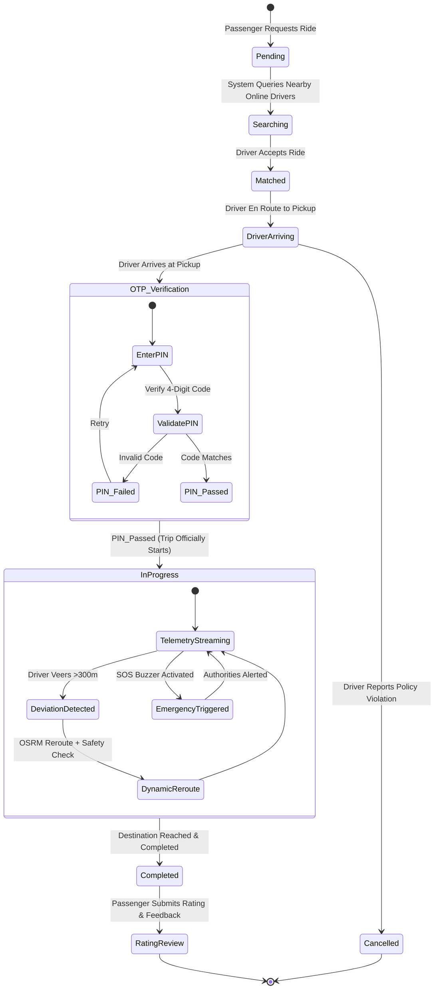
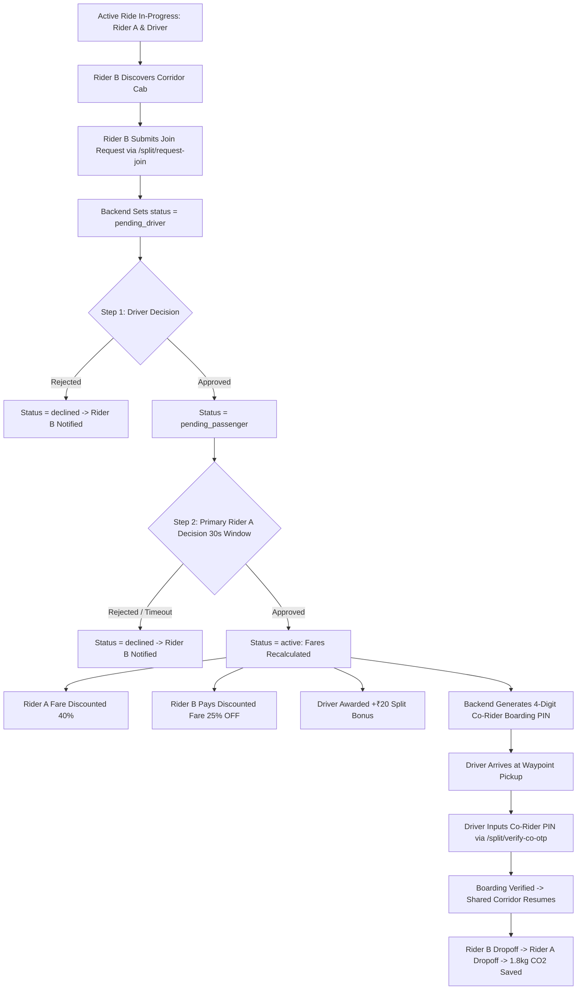
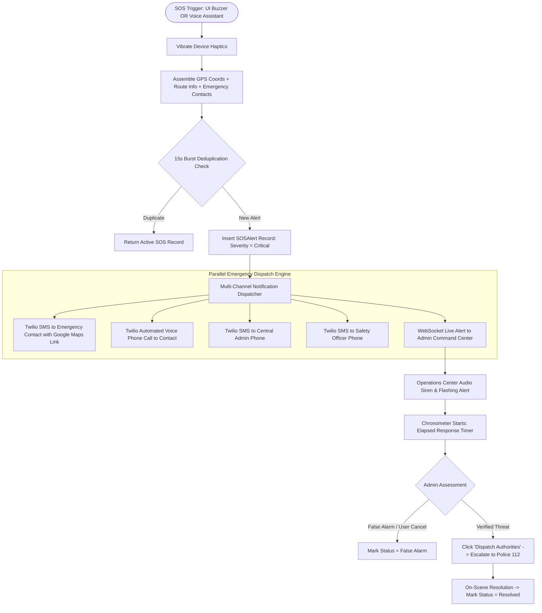
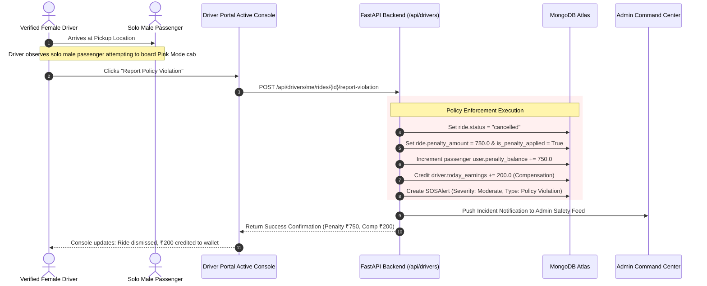

# 🛡️ SafeGo: Complete Architectural Specification, System Ideation & File Workflow Blueprint

> **File Name**: `All_details.md`  
> **Repository**: [Safe-Go](file:///d:/My%20projects/Safe-Go)  
> **Platform Version**: 2.0.0 (Production Architecture)  
> **Core Focus**: Intelligent Ride Safety Platform, Geo-ML Risk Engines, Inclusive Mobility Modes, SafeGo Split Co-Riding, Real-Time Emergency Escalation, and Multi-Role Workflows.

---

## 📑 Comprehensive Table of Contents
1. [Executive Overview & SafeGo Vision](#1-executive-overview--safego-vision)
2. [High-Level System Architecture & Technology Stack](#2-high-level-system-architecture--technology-stack)
3. [Dual Machine Learning Engines & Geo-Intelligence Engine](#3-dual-machine-learning-engines--geo-intelligence-engine)
   - [3.1 Geographical Safety Classifier (`predictor.py`)](#31-geographical-safety-classifier-predictorpy)
   - [3.2 Dynamic Fare Surge Regressor (`fare_predictor.py`)](#32-dynamic-fare-surge-regressor-fare_predictorpy)
   - [3.3 Real-Time Route Deviation Detection & Dynamic Rerouting](#33-real-time-route-deviation-detection--dynamic-rerouting)
   - [3.4 4.2k+ Indian Cities Geocoding Engine (`geo_service.py`)](#34-42k-indian-cities-geocoding-engine-geo_servicepy)
4. [Core Innovative Features & Safety Paradigms](#4-core-innovative-features--safety-paradigms)
   - [4.1 Five Inclusive Ride Modes & Strict Policy Enforcement](#41-five-inclusive-ride-modes--strict-policy-enforcement)
   - [4.2 SafeGo Pink Mode: Female Shield & Solo Male Penalty Enforcement](#42-safego-pink-mode-female-shield--solo-male-penalty-enforcement)
   - [4.3 SafeGo Split: Dynamic Corridor Co-Riding with Double Approval](#43-safego-split-dynamic-corridor-co-riding-with-double-approval)
   - [4.4 Passenger 4-Digit Security PIN (OTP) Boarding Verification](#44-passenger-4-digit-security-pin-otp-boarding-verification)
   - [4.5 Multi-Channel Emergency SOS & Rapid Threat Escalation](#45-multi-channel-emergency-sos--rapid-threat-escalation)
   - [4.6 Browser-Native Speech AI Assistant](#46-browser-native-speech-ai-assistant)
   - [4.7 Multilingual Internationalization (6 Languages)](#47-multilingual-internationalization-6-languages)
   - [4.8 Elder & Accessibility Framework (High Contrast & Large Touch Targets)](#48-elder--accessibility-framework-high-contrast--large-touch-targets)
5. [End-to-End Role-Based Workflows (Every View Analyzed)](#5-end-to-end-role-based-workflows-every-view-analyzed)
   - [5.1 Passenger Workflow: Discovery, Booking, OTP Boarding, Ride, & Rating](#51-passenger-workflow-discovery-booking-otp-boarding-ride--rating)
   - [5.2 Driver Workflow: Onboarding, Dispatch, Navigation, OTP Verification, & Violations](#52-driver-workflow-onboarding-dispatch-navigation-otp-verification--violations)
   - [5.3 Admin Command Center Workflow: Fleet Matrix, Live Telemetry, & SOS Dispatch](#53-admin-command-center-workflow-fleet-matrix-live-telemetry--sos-dispatch)
6. [Interactive Sequence & State Transition Flowcharts](#6-interactive-sequence--state-transition-flowcharts)
   - [6.1 Authentication & Role-Based Guard Flow](#61-authentication--role-based-guard-flow)
   - [6.2 Complete Ride Lifecycle: Booking to Completion](#62-complete-ride-lifecycle-booking-to-completion)
   - [6.3 SafeGo Split (Double Approval & Waypoint Boarding) Flow](#63-safego-split-double-approval--waypoint-boarding-flow)
   - [6.4 SOS Emergency Alert, Twilio Multicast & Resolution Flow](#64-sos-emergency-alert-twilio-multicast--resolution-flow)
   - [6.5 Pink Mode Policy Violation & Driver Compensation Flow](#65-pink-mode-policy-violation--driver-compensation-flow)
7. [Database Schemas & Data Models (MongoDB Beanie ODM)](#7-database-schemas--data-models-mongodb-beanie-odm)
8. [Complete API & WebSocket Telemetry Reference](#8-complete-api--websocket-telemetry-reference)
9. [Comprehensive Codebase & File Workflow Blueprint](#9-comprehensive-codebase--file-workflow-blueprint)
   - [9.1 Frontend Source Tree (`/src`)](#91-frontend-source-tree-src)
   - [9.2 Backend Source Tree (`/backend`)](#92-backend-source-tree-backend)
   - [9.3 File-by-File Cross-Layer Responsibility Mapping](#93-file-by-file-cross-layer-responsibility-mapping)
10. [Security Engineering, IDOR Protection & Operational Resiliency](#10-security-engineering-idor-protection--operational-resiliency)
11. [Setup, Local Execution & Cloud Deployment Guide](#11-setup-local-execution--cloud-deployment-guide)

---

## 1. Executive Overview & SafeGo Vision

**SafeGo** is an enterprise-grade, safety-first urban mobility platform engineered to solve the systemic safety vulnerabilities, gender exclusion, accessibility friction, and lack of real-time situational awareness inherent in traditional ride-hailing networks.

Traditional platforms treat passenger safety as a reactive checkbox—typically limited to an isolated, unmonitored SOS button that sends an SMS with significant latency. SafeGo fundamentally redesigns urban transit around **Proactive, Real-Time Geo-Machine Learning Safety**:

1. **Autonomous Route Safety Classification**: Evaluates every route before confirmation using spatial risk modeling, proximity to designated safe urban hubs, distance to peripheral risk hotspots, time of day, and trip parameters.
2. **Inclusive Safety Policies**: Strict gender-aligned matching in **Pink Mode** (female-only verified drivers and verified female passengers) backed by database-level policy checks, accompanied declaration tracking, and financial penalties for violations.
3. **SafeGo Split (Dynamic Co-Riding)**: A double-approval corridor ridesharing architecture where verified travelers sharing a route segment split costs (40% discount for primary rider, 25% discount for co-rider), earn bonus income for the driver (+₹20), reduce carbon emissions (1.8 kg CO₂ per trip), and ensure safety through two-party verification.
4. **4-Digit Boarding Verification PIN (OTP)**: Prevents wrong-car boarding, unauthorized driver takeovers, and fraudulent trip initiations by requiring driver cryptographic PIN entry before state mutation to `in_progress`.
5. **Multi-Channel Emergency Escalation**: Hardware/software haptic SOS trigger with automated Twilio Voice Calls, SMS notifications with live Google Maps coordinate links, central Admin siren broadcast, and direct police/authorities dispatch.
6. **4,231 Indian Cities Geocoding Engine**: Native, zero-latency in-memory spatial resolution across all 34 Indian States & Union Territories.

---

## 2. High-Level System Architecture & Technology Stack

SafeGo utilizes a decoupled, asynchronous micro-architecture optimized for sub-10ms machine learning inference, real-time WebSocket vehicle telemetry, and zero-downtime emergency failovers.



### Technology Matrix

| Layer | Technologies Used | Rationale & Responsibility |
| :--- | :--- | :--- |
| **Frontend Framework** | React 18, TypeScript, Vite | Single-page application architecture, type safety, lightning-fast HMR and bundle compilation. |
| **Styling & Design System** | TailwindCSS, Shadcn UI, Framer Motion | Curated HSL color palette, accessible Radix UI primitives, glassmorphism, micro-animations. |
| **Map & Geospatial Visuals** | Leaflet.js, Esri World Imagery, OSRM | High-resolution satellite tile rendering, road boundaries overlay, dynamic animated polylines, no API key cost. |
| **Client State & Network** | TanStack React Query v5, Context API | Server-state caching, background data synchronization, role-based session persistence. |
| **Internationalization** | i18next, react-i18next | Multi-language translation across 6 languages (EN, HI, TE, TA, FR, ES). |
| **Speech AI Controller** | Web Speech API (`SpeechRecognition`, `SpeechSynthesis`) | Browser-native hands-free navigation, voice ride booking, voice-activated emergency triggers. |
| **Backend Framework** | FastAPI (Python 3.10+) | High-throughput asynchronous ASGI web server, automatic OpenAPI schema generation, strict Pydantic typing. |
| **Database & ODM** | MongoDB, Beanie ODM, Motor | Schema-enforced document storage, asynchronous I/O, native geospatial indexing, soft-delete capabilities. |
| **Machine Learning Core** | Scikit-Learn, Joblib, NumPy, Pandas | Dual Random Forest pipelines for safety risk classification and dynamic fare surge calculation. |
| **Emergency Telephony** | Twilio REST API, TwiML | Automated outbound voice phone calls (`<Say voice='alice'>`) and geocoded emergency SMS dispatches. |
| **Document Storage** | Cloudinary REST API | Encrypted cloud storage for driver verification documents (License, Vehicle Registration, NBI Clearance). |
| **Real-Time Streaming** | WebSockets (Native FastAPI WS) | 1-to-many vehicle GPS coordinate broadcasting, dynamic trip rerouting, driver arrival tracking. |

---

## 3. Dual Machine Learning Engines & Geo-Intelligence Engine

SafeGo features two interconnected Scikit-Learn models and a specialized in-memory spatial index that drive ride safety badges, pricing multipliers, and route optimization.

```
backend/app/ml/
├── saved_models/
│   ├── safety_rf_model.joblib        # Pre-trained Random Forest Safety Classifier
│   ├── safety_scaler.joblib          # StandardScaler for Spatial Features
│   ├── fare_surge_rf_model.joblib    # Pre-trained Random Forest Surge Regressor
│   └── fare_surge_scaler.joblib      # StandardScaler for Dynamic Fare Features
├── predictor.py                      # SafetyPredictor Singleton
├── fare_predictor.py                 # FareSurgePredictor Singleton
├── train.py                          # Synthetic Dataset Generation & Safety Training
├── train_fare.py                     # Synthetic Dataset Generation & Surge Training
├── evaluate_safety_model.py          # Model Metrics & Confusion Matrix Evaluation
├── test_inference.py                 # Safety Unit Tests
└── test_fare_inference.py            # Fare Unit Tests
```

---

### 3.1 Geographical Safety Classifier (`predictor.py`)

The Geographical Safety Classifier evaluates the relative risk score of any proposed corridor using multidimensional temporal, behavioral, and geographical inputs:

* **Classifier Algorithm**: `RandomForestClassifier` initialized with balanced class weighting (`class_weight="balanced"`) to handle rare high-risk edge cases.
* **Output Classes**:
  * 🟢 **`Stable`**: High-safety corridor (optimal street lighting, dense urban hub proximity, low crime risk).
  * 🟡 **`Cautious`**: Moderate-risk corridor (peripheral routes, late evening hours, intermediate distance to police facilities).
  * 🔴 **`High Priority`**: Elevated-risk corridor (isolated roads, late night 23:00–04:00, extended distance to safe hubs). Triggers proactive telemetry monitoring.
* **Engineered Feature Vector**:
  $$\vec{F}_{\text{safety}} = \begin{bmatrix}
  t_{\text{hour}}, & \text{DoW}, & d_{\text{km}}, & N_{\text{passengers}}, & M_{\text{mode}}, \\
  \phi_{\text{pickup}}, & \lambda_{\text{pickup}}, & \phi_{\text{dest}}, & \lambda_{\text{dest}}, & d_{\text{safe\_hub}}^{\text{pickup}}, & d_{\text{safe\_hub}}^{\text{dest}}, & I_{\text{hotspot}}
  \end{bmatrix}$$
  * $d_{\text{safe\_hub}}$: Calculated via Haversine distance to predefined urban security centers, 24/7 medical hubs, and transport terminals.
  * $I_{\text{hotspot}}$: Binary spatial flag detecting whether the coordinate falls within historical low-density corridors.
* **Sub-10ms Inference**: Features are normalized via `safety_scaler.joblib` and evaluated with single-thread thread optimization (`n_jobs=1`), ensuring sub-10ms response times.
* **Fallback Guarantee**: If serialized models are absent, a deterministic spatial-temporal heuristic engine guarantees uninterrupted service.

---

### 3.2 Dynamic Fare Surge Regressor (`fare_predictor.py`)

Rather than relying purely on supply-and-demand spikes (like traditional ride-hailing), SafeGo directly integrates route safety into dynamic pricing:

* **Regression Algorithm**: `RandomForestRegressor` tuned for continuous multiplier outputs in the range $[1.00\times, 2.20\times]$.
* **Feature Coupling**: In addition to distance, passenger count, pickup hour, and day of week, the regressor accepts the **`ai_safety_prediction`** class output from the safety classifier.
* **Formula**:
  $$\text{Final Fare} = \text{round}\left(\text{Base Fare}(d_{\text{km}}, M_{\text{mode}}) \times \text{Surge Multiplier}, 2\right)$$
  Where $\text{Base Fare}$ is calculated via standard mode tariff rules, and $\text{Surge Multiplier}$ is inferred dynamically by `fare_surge_rf_model.joblib`.

---

### 3.3 Real-Time Route Deviation Detection & Dynamic Rerouting

During an active ride, driver telemetry coordinates are streamed via WebSocket (`/ws/driver/{driver_id}/location`).
1. **Deviation Threshold**: If a driver strays $\ge 300\text{ meters}$ from the designated OSRM polyline, or triggers a manual detour:
2. **Dynamic Reroute Service (`map_service.reroute_active_trip`)**:
   - Re-queries the OSRM routing engine with the driver's current coordinates $(\phi_{\text{cur}}, \lambda_{\text{cur}})$ and destination $(\phi_{\text{dest}}, \lambda_{\text{dest}})$.
   - Immediately re-evaluates `SafetyPredictor.predict_safety()` on the recalculated detour.
   - Pushes an emergency updated polyline, revised ETA, and new safety index to both passenger and admin monitors via WebSocket without disconnecting the session.

---

### 3.4 4.2k+ Indian Cities Geocoding Engine (`geo_service.py`)

* **Dataset**: `Indian Cities Geo Data.csv` indexes 4,231 verified Indian cities, towns, and regions spanning all 34 States and Union Territories.
* **Zero-Latency In-Memory Trie**: Upon backend initialization, the dataset is indexed into memory.
* **Search Hierarchy**:
  1. **Exact Prefix Match**: Queries starting with the search string are surfaced first.
  2. **Substring & State Fuzzy Match**: Matches query terms in the city name or state name.
  3. **Photon OpenStreetMap Fallback**: If local matches return empty, the query falls back to Photon OSM.
  4. **Nominatim Fallback**: Final fallback to server-side OpenStreetMap Nominatim with custom User-Agent headers.

---

## 4. Core Innovative Features & Safety Paradigms

---

### 4.1 Five Inclusive Ride Modes & Strict Policy Enforcement

SafeGo offers 5 specialized ride modes, configured in [modeConfig.ts](file:///d:/My%20projects/Safe-Go/src/config/modeConfig.ts):

| Mode | Visual Accent | Target Demographic | Core Requirements & Safeguards |
| :--- | :--- | :--- | :--- |
| **Normal** | 🟢 Emerald (`#10b981`) | General public | Standard fast matching, verified pilots, dynamic route safety scores. |
| **Pink Mode** | 🌸 Fuchsia (`#ec4899`) | Women & accompanying passengers | Verified female drivers only; strict solo-male booking prohibition; penalty enforcement. |
| **PWD Mode** | ♿ Cyan (`#06b6d4`) | Passengers with physical disabilities | Wheelchair-accessible vehicle certification; high-contrast UI; audio assistance. |
| **Elderly Mode**| 🟠 Amber (`#f59e0b`) | Senior citizens | Simplified interface; large touch targets; automated caregiver status SMS. |
| **Premium** | 💎 Indigo (`#6366f1`) | Business & executive | Top-tier vehicles; drivers with 4.8+ ratings; priority support routing. |

---

### 4.2 SafeGo Pink Mode: Female Shield & Solo Male Penalty Enforcement

Pink Mode provides an uncompromising protective framework for women passengers:
1. **Gender Validation**: Frontend and backend enforce gender restrictions. If a registered male user requests a Pink Mode ride without declaring an accompanied female passenger, the booking is rejected (`HTTP 403 Forbidden`).
2. **Accompanied Declaration**: Male riders can only use Pink Mode if accompanied by a female passenger, requiring declaration of the female passenger's name in `RideRequest.female_passenger_name`.
3. **Driver Policy Violation Reporting Console**:
   - If a driver arrives at the pickup point and observes a solo male passenger violating Pink Mode policies, the driver clicks **"Report Policy Violation"** in the [DriverPortal](file:///d:/My%20projects/Safe-Go/src/pages/DriverPortal.tsx).
   - **System Actions**:
     - Automatically cancels the trip with status `cancelled` and reason `Policy Violation: Solo Male Passenger in SafeGo Pink Mode`.
     - Levies a **₹750 penalty fine** onto the passenger's account balance (`user.penalty_balance`).
     - Credits the driver with **₹200 inconvenience compensation** (`driver.today_earnings`).
     - Dispatches a priority incident notification to the Admin Command Center (`SOSAlert` with severity `moderate`).

---

### 4.3 SafeGo Split: Dynamic Corridor Co-Riding with Double Approval

SafeGo Split reimagines carpooling into an automated, double-approved corridor co-riding platform:



* **Double-Approval Protocol**: Both the Driver and Primary Rider A must explicitly consent before a co-rider can join.
* **Financial Incentives**:
  * **Primary Rider A**: Receives a **40% discount** off their original fare (e.g., ₹100 drops to ₹60).
  * **Co-Rider B**: Receives a **25% discount** off typical solo rates (e.g., ₹80 drops to ₹60).
  * **Driver**: Earns an immediate **+₹20 split bonus** on top of normal trip earnings.
* **Environmental Impact**: Automatically calculates and attributes **1.8 kg CO₂ emissions saved** per shared trip.
* **Pink Mode Isolation**: Solo males are blocked from joining active Pink Mode split corridors.

---

### 4.4 Passenger 4-Digit Security PIN (OTP) Boarding Verification

To eliminate unauthorized pickups and driver fraud:
1. When a ride is booked, the backend generates a random 4-digit cryptographic OTP (`ride.otp`), securely stored in the database and visible **only** on the passenger's booking console.
2. When the driver arrives, the passenger verbally provides this PIN.
3. The driver enters the 4-digit code in the **Driver Active Console** (`POST /api/rides/{id}/verify-otp`).
4. **Backend State Guard**: The backend rejects any attempt to transition the ride status to `in_progress` unless `is_otp_verified == True`.

---

### 4.5 Multi-Channel Emergency SOS & Rapid Threat Escalation

SafeGo's SOS system is built for resilience under real-world distress conditions:

1. **Multi-Modal Activation**:
   - **Hardware/Software UI Button**: Floating red shield buzzer with haptic feedback (`navigator.vibrate([250, 100, 250])`).
   - **Voice-Activated SOS**: Saying *"Emergency"*, *"Help"*, or *"SafeGo SOS"* triggers hands-free activation via the voice assistant.
2. **Deduplication & Concurrency Guard**:
   - Enforces a 15-second burst deduplication window using client `idempotency_key` and database timestamps to prevent alert flooding.
3. **Multi-Channel Dispatching Engine (`notification_service.py`)**:
   - **Emergency Contact SMS**: Sends an SMS containing the live Google Maps pin, destination address, and route details.
   - **Automated Emergency Voice Call**: Outbound phone call using Twilio Voice TwiML (`<Say voice='alice'>SafeGo Emergency Voice Alert...</Say>`).
   - **Central Authority Alerts**: SMS alerts dispatched to Admin and Safety Officer phone numbers (`ADMIN_PHONE`, `TESTER_PHONE`).
4. **Admin Command Center Integration**:
   - Triggers an audible siren and flashing visual banner in the Admin Dashboard.
   - Displays a live chronometer timer tracking elapsed response time down to milliseconds (`00:14.82`).
   - Offers a one-click **"Dispatch Authorities"** escalation button (`/api/safety/sos/{id}/dispatch-authorities`) to notify police control rooms.

---

### 4.6 Browser-Native Speech AI Assistant

Configured in [VoiceAssistantContext.tsx](file:///d:/My%20projects/Safe-Go/src/contexts/VoiceAssistantContext.tsx):
* **Web Speech Recognition**: Continuously listens for navigational and emergency commands in natural language.
* **Supported Voice Commands**:
  * *"Book a ride to Vadodara Station"* $\rightarrow$ Auto-fills destination and triggers route search.
  * *"Where is my driver?"* $\rightarrow$ Reads out driver ETA and current distance.
  * *"Share my location"* $\rightarrow$ Pushes current GPS coordinates to emergency contacts.
  * *"Trigger SOS"* / *"Help"* $\rightarrow$ Activates critical emergency dispatch.
* **Text-to-Speech (TTS)**: Provides spoken confirmations, trip updates, and accessible directions via `window.speechSynthesis`.

---

### 4.7 Multilingual Internationalization (6 Languages)

Configured in [i18n.ts](file:///d:/My%20projects/Safe-Go/src/i18n.ts), supporting real-time switching without page reload across 6 locales:
* 🇬🇧 English (`en`)
* 🇮🇳 Hindi (`hi` - हिंदी)
* 🇮🇳 Telugu (`te` - తెలుగు)
* 🇮🇳 Tamil (`ta` - தமிழ்)
* 🇫🇷 French (`fr` - Français)
* 🇪🇸 Spanish (`es` - Español)

Translation dictionaries are modularized under `src/locales/{lang}.json`, covering UI primitives, safety badges, error alerts, and booking maneuvers.

---

### 4.8 Elder & Accessibility Framework (High Contrast & Large Touch Targets)

Configured in [ElderModeContext.tsx](file:///d:/My%20projects/Safe-Go/src/contexts/ElderModeContext.tsx):
* **Visual Adaptations**: Activates high-contrast color palettes, enlarged fonts (1.25x base scale), and oversized touch targets ($\ge 56\text{px}$).
* **Cognitive Simplification**: Streamlines booking to a one-click process with reduced clutter.
* **Automated Caregiver Check-ins**: Sends SMS status notifications to designated caregivers at trip start and trip completion.

---

## 5. End-to-End Role-Based Workflows (Every View Analyzed)

---

### 5.1 Passenger Workflow: Discovery, Booking, OTP Boarding, Ride, & Rating

```
[Home Page / Mode Select] 
       │
       ▼
[Authentication / Login / Firebase / Guest]
       │
       ▼
[Booking Page (/book/:mode)] ──► Geolocation / Indian Cities Search / Pinpoint Map
       │
       ▼
[Route Analysis] ──► ML Safety Classifier & Dynamic Fare Regression Preview
       │
       ├──► [Option A: Opt-in SafeGo Split] ──► Browse Corridor Cabs (40% discount)
       └──► [Option B: Standard Solo Ride]
       │
       ▼
[Confirm Booking] ──► Driver Matching & Unique 4-Digit Boarding OTP Generated
       │
       ▼
[Driver Arrives] ──► Passenger shares 4-Digit OTP ──► Driver Enters PIN
       │
       ▼
[Ride In-Progress] ──► Real-Time Satellite Map Telemetry & Live Polyline
       │          └──► [Optional Emergency: Tap SOS Button / Voice Trigger]
       ▼
[Arrival at Destination] ──► Driver Completes Trip
       │
       ▼
[Review & Rating Dialog] ──► Star Rating + Text Review ──► NLP Sentiment Analysis
       │
       ▼
[Passenger Dashboard (/dashboard)] ──► View Trip History, Soft Delete, Manage Contacts
```

1. **Authentication**: Passenger logs in using Email/Password, Phone OTP (`/api/auth/send-otp`), or Firebase Google OAuth.
2. **Mode Configuration**: Selects an inclusive ride mode (Normal, Pink, PWD, Elderly, Premium).
3. **Location Selection**: Selects pickup and dropoff points via GPS geolocation, the 4.2k+ Indian Cities search engine, or clicking directly on the Leaflet Satellite map.
4. **Machine Learning Evaluation**: The backend calculates the route, displays the turn-by-turn polyline, evaluates safety risk via `predictor.py`, and computes the dynamic fare via `fare_predictor.py`.
5. **Booking Dispatch**: Passenger confirms booking (`POST /api/rides/request`), generating an active ride record and displaying their unique 4-digit boarding PIN.
6. **Boarding Verification**: Passenger shares the 4-digit PIN with the driver to officially start the trip.
7. **Telemetry & Live Tracking**: Real-time GPS movement and ETA updates stream via WebSocket (`/ws/ride/{id}/track`).
8. **Completion & Sentiment Rating**: Upon arrival, passenger rates the driver ($1-5$ stars). Reviews are analyzed for sentiment polarity using TextBlob NLP (`Positive`, `Neutral`, `Critical`).

---

### 5.2 Driver Workflow: Onboarding, Dispatch, Navigation, OTP Verification, & Violations

```
[Driver Application (/apply-driver)] ──► Upload License, RC, NBI Clearance to Cloudinary
       │
       ▼
[Admin Review & Approval Queue] ──► Documents Verified ──► Driver Profile Activated
       │
       ▼
[Driver Portal (/driver)] ──► Toggle Online Status (is_online = True)
       │
       ▼
[Available Rides Radar] ──► Real-time matching based on location and mode eligibility
       │
       ▼
[Accept Ride Request] ──► Trip status transitions to 'matched' / 'driver_arriving'
       │
       ▼
[In-App Turn-by-Turn Navigation Map] ──► GPS Telemetry Broadcast (/ws/driver/location)
       │
       ├──► [Pickup Scenario A: Normal Passenger] 
       │          └──► Prompt for 4-Digit Boarding OTP ──► Status: 'in_progress'
       │
       ├──► [Pickup Scenario B: Pink Mode Policy Violation (Solo Male)]
       │          └──► Click "Report Policy Violation" ──► Trip Cancelled + ₹750 Fine to Rider + ₹200 to Driver
       │
       └──► [En Route Scenario C: SafeGo Split Corridor Request]
                  └──► Accept Co-Rider (+₹20 Bonus) ──► Waypoint Pickup ──► Verify Co-Rider PIN
       │
       ▼
[Destination Reached] ──► Click "Complete Ride & Collect Fare"
       │
       ▼
[Driver Earnings & Analytics] ──► Real-time today's earnings, acceptance rate, and ratings
```

1. **Onboarding**: Driver submits personal details, vehicle specs, and documents via [ApplyDriver.tsx](file:///d:/My%20projects/Safe-Go/src/pages/ApplyDriver.tsx). Files are uploaded to Cloudinary (`/api/drivers/apply-with-docs`).
2. **Approval Verification**: Once approved by an Admin, the driver logs in to the [DriverPortal](file:///d:/My%20projects/Safe-Go/src/pages/DriverPortal.tsx).
3. **Online Dispatch**: Driver toggles their status to **Online**, connecting to the WebSocket telemetry engine.
4. **Ride Acceptance**: Incoming ride requests display pickup distance, passenger rating, fare amount, and corridor route. The driver clicks **Accept**.
5. **Navigation & Verification**:
   - The driver follows turn-by-turn navigation on the Leaflet map.
   - At pickup, the driver prompts the passenger for their 4-digit PIN and verifies it via the console.
   - If a Pink Mode violation is detected (e.g., solo male passenger), the driver reports it, receiving ₹200 compensation while the rider is fined ₹750.
6. **Completion**: Driver marks the trip complete, automatically updating earnings, acceptance rates, and ride history.

---

### 5.3 Admin Command Center Workflow: Fleet Matrix, Live Telemetry, & SOS Dispatch

```
[Admin Command Center (/admin)]
  ├── 1. Operations Hub (KPI Matrix, Fleet Status, Recharts Mode Distributions)
  ├── 2. Mission Control (Real-Time Live Fleet Satellite Map & Active Trips)
  ├── 3. Identity Registry (User Management, Verification, Penalties, Role Shifts)
  ├── 4. Fleet Intelligence (Approved Drivers, Ratings, Vehicle Specs, Full Dossiers)
  ├── 5. Driver Applications Queue (Document Verification, Cloudinary Inspection, Approvals)
  └── 6. Safety Command Center (Active SOS Alerts, Live Siren, Chronometer, Police Escalation)
```

1. **Operations Hub**: Real-time overview of total passengers, active drivers, in-progress rides, active SOS alarms, and safety score trends.
2. **Mission Control**: Interactive satellite tracking map displaying every moving vehicle in the city with live speed, polyline corridors, and deviation alerts.
3. **Application Review Queue**: Admins inspect driver-submitted licenses, registrations, and background checks using high-resolution Cloudinary previews, with one-click **Approve** or **Reject** actions.
4. **Safety Command Center**: When an SOS alert fires:
   - An audio-visual alarm triggers across the operations room.
   - The interface focuses on the vehicle's real-time coordinates, passenger name, driver info, and emergency contacts.
   - Admins can escalate to local police authorities with one click, transmitting complete telemetry details via Twilio.

---

## 6. Interactive Sequence & State Transition Flowcharts

---

### 6.1 Authentication & Role-Based Guard Flow



---

### 6.2 Complete Ride Lifecycle: Booking to Completion



---

### 6.3 SafeGo Split (Double Approval & Waypoint Boarding) Flow



---

### 6.4 SOS Emergency Alert, Twilio Multicast & Resolution Flow



---

### 6.5 Pink Mode Policy Violation & Driver Compensation Flow



---

## 7. Database Schemas & Data Models (MongoDB Beanie ODM)

Configured in [models/__init__.py](file:///d:/My%20projects/Safe-Go/backend/app/models/__init__.py), backed by Beanie Document ODM:

### 1. `users` Collection
| Field | Type | Modifiers / Index | Description |
| :--- | :--- | :--- | :--- |
| `_id` | `PydanticObjectId` | Primary Key | Unique document identifier. |
| `full_name` | `str` | Required | Passenger or driver's full legal name. |
| `email` | `str` | `Indexed(unique=True)` | Verified unique email address. |
| `phone` | `str` | `Indexed(unique=True)` | Formatted phone number with country code. |
| `firebase_uid` | `Optional[str]` | `Indexed(unique=True)` | Associated Firebase OAuth UID. |
| `hashed_password` | `Optional[str]` | Nullable | Bcrypt/PBKDF2 salted password hash. |
| `role` | `UserRole` | Default: `passenger` | Enum: `passenger`, `driver`, `staff`, `admin`. |
| `preferred_mode` | `RideMode` | Default: `normal` | Enum: `normal`, `pink`, `pwd`, `elderly`, `premium`. |
| `gender` | `Gender` | Default: `male` | Enum: `male`, `female`, `other`. |
| `penalty_balance`| `float` | Default: `0.0` | Accumulated unpaid safety policy violation fines. |
| `is_elder` | `bool` | Default: `False` | Toggles Elder Mode accessibility defaults. |
| `is_active` | `bool` | Default: `True` | Account operational status. |
| `is_verified` | `bool` | Default: `False` | Identity verification state. |
| `created_at` | `datetime` | UTC Timestamp | Account registration timestamp. |

---

### 2. `drivers` Collection
| Field | Type | Modifiers / Index | Description |
| :--- | :--- | :--- | :--- |
| `_id` | `PydanticObjectId` | Primary Key | Driver record identifier. |
| `user_id` | `PydanticObjectId` | Foreign Key (`users`) | Reference to the associated user document. |
| `license_number`| `str` | `Indexed(unique=True)` | Driver's official motor license number. |
| `status` | `DriverStatus` | Default: `pending` | Enum: `pending`, `approved`, `rejected`, `suspended`. |
| `is_online` | `bool` | Default: `False` | Real-time availability flag for ride matching. |
| `current_latitude`| `Optional[float]`| Nullable | Last known GPS latitude. |
| `current_longitude`| `Optional[float]`| Nullable | Last known GPS longitude. |
| `average_rating` | `float` | Default: `0.0` | Rolling weighted passenger rating ($1.0 - 5.0$). |
| `total_rides` | `int` | Default: `0` | Lifetime completed trips count. |
| `today_rides` | `int` | Default: `0` | Trips completed during the current UTC day. |
| `today_earnings` | `float` | Default: `0.0` | Revenue earned during the current day (₹). |
| `acceptance_rate`| `float` | Default: `100.0` | Percentage of accepted ride dispatches. |
| `certified_modes`| `List[str]` | Default: `["normal"]` | Modes this pilot is certified to service. |
| `approved_at` | `Optional[datetime]`| Nullable | Timestamp of admin onboarding approval. |

---

### 3. `vehicles` Collection
| Field | Type | Modifiers / Index | Description |
| :--- | :--- | :--- | :--- |
| `_id` | `PydanticObjectId` | Primary Key | Vehicle identifier. |
| `driver_id` | `PydanticObjectId` | Foreign Key (`drivers`) | Associated driver reference. |
| `make` | `str` | Required | Manufacturer (e.g., Toyota, Hyundai, Tata). |
| `model` | `str` | Required | Model name (e.g., Innova, Camry, Nexon). |
| `year` | `int` | Required | Manufacturing year. |
| `color` | `str` | Required | Vehicle exterior color. |
| `plate_number` | `str` | `Indexed(unique=True)` | State motor vehicle registration plate. |
| `is_wheelchair_accessible` | `bool` | Default: `False` | Ramps/lifts qualification for PWD Mode. |
| `is_approved` | `bool` | Default: `False` | Admin vehicle compliance clearance. |

---

### 4. `driver_documents` Collection
| Field | Type | Modifiers / Index | Description |
| :--- | :--- | :--- | :--- |
| `_id` | `PydanticObjectId` | Primary Key | Document record identifier. |
| `driver_id` | `PydanticObjectId` | Foreign Key (`drivers`) | Associated driver reference. |
| `document_type` | `DocumentType` | Required | Enum: `drivers_license`, `vehicle_registration`, `nbi_clearance`, `vehicle_insurance`, `medical_certificate`. |
| `file_url` | `Optional[str]` | Nullable | Encrypted Cloudinary CDN secure URL. |
| `status` | `DocumentStatus` | Default: `upload_required`| Enum: `upload_required`, `pending`, `verified`, `rejected`. |
| `reviewed_by` | `Optional[PydanticObjectId]` | Foreign Key (`users`) | Admin user who reviewed the document. |
| `notes` | `Optional[str]` | Nullable | Admin review feedback or rejection reasons. |

---

### 5. `rides` Collection
| Field | Type | Description |
| :--- | :--- | :--- |
| `_id` | `PydanticObjectId` | Unique trip identifier. |
| `passenger_id` | `PydanticObjectId` | Primary booking passenger ID. |
| `driver_id` | `Optional[PydanticObjectId]` | Matched driver ID. |
| `mode` | `RideMode` | Ride mode (normal, pink, pwd, elderly, premium). |
| `status` | `RideStatus` | Lifecycle state: `pending`, `searching`, `matched`, `driver_arriving`, `in_progress`, `completed`, `cancelled`. |
| `pickup_address` | `str` | Human-readable pickup location. |
| `pickup_latitude` / `longitude` | `float` | Geocoded pickup coordinates. |
| `destination_address` | `str` | Human-readable dropoff location. |
| `destination_latitude` / `longitude` | `float` | Geocoded dropoff coordinates. |
| `distance_km` / `duration_minutes` | `float` | OSRM road distance and estimated travel duration. |
| `fare_amount` | `float` | Dynamically calculated trip price (₹). |
| `safety_score` | `int` | Integer safety badge index ($0 - 100$). |
| `route_polyline` | `str` | GeoJSON encoded coordinate string of the route. |
| `otp` | `str` | Unique 4-digit passenger boarding PIN. |
| `is_otp_verified` | `bool` | Guard flag controlling transition to `in_progress`. |
| **SafeGo Split Fields** | | |
| `is_split_allowed` / `is_split_active` | `bool` | Corridor sharing opt-in and active status. |
| `split_status` | `str` | State: `none`, `pending_driver`, `pending_passenger`, `active`, `completed`, `declined`. |
| `split_passenger_id` | `Optional[PydanticObjectId]` | Secondary co-passenger user ID. |
| `split_passenger_name` | `Optional[str]` | Secondary co-passenger legal name. |
| `original_fare` / `discounted_fare` | `float` | Fare adjustments (Primary rider receives 40% discount). |
| `split_co_passenger_fare` | `float` | Discounted fare for Co-Rider B (25% discount). |
| `driver_split_bonus` | `float` | Driver bonus credit (+₹20). |
| `split_otp` | `str` | 4-digit security PIN for co-passenger waypoint pickup. |
| `is_split_otp_verified` | `bool` | Co-passenger boarding verification flag. |
| `co2_saved_kg` | `float` | Environmental emissions savings credit ($1.8\text{ kg}$). |
| **Policy & Violation Fields** | | |
| `has_female_passenger_declared` | `bool` | Accompanied female passenger declaration flag. |
| `female_passenger_name` | `Optional[str]` | Declared companion name for Pink Mode male bookings. |
| `penalty_amount` | `Optional[float]` | Fine levied on rider for policy violations (₹750). |
| `is_penalty_applied` | `bool` | Indicates whether a policy fine was charged. |
| `driver_compensation_amount` | `Optional[float]` | Compensation credited to driver for reporting violations (₹200). |
| `is_deleted_by_user` | `bool` | Soft-delete flag for passenger history privacy. |

---

### 6. `sos_alerts` Collection
| Field | Type | Description |
| :--- | :--- | :--- |
| `_id` | `PydanticObjectId` | Unique emergency alert identifier. |
| `user_id` | `PydanticObjectId` | Distressed user reference. |
| `ride_id` | `Optional[PydanticObjectId]` | Associated active ride reference. |
| `latitude` / `longitude` | `float` | Real-time GPS location where SOS was triggered. |
| `location_address` | `str` | Best-effort reverse geocoded address. |
| `emergency_contact_phone` | `str` | Target contact number alerted via Twilio SMS and Voice. |
| `severity` | `SOSSeverity` | Enum: `low`, `moderate`, `critical`. |
| `status` | `SOSStatus` | State: `active`, `resolved`, `false_alarm`. |
| `idempotency_key` | `Optional[str]` | Unique token preventing alert duplication during burst triggers. |
| `resolved_by` | `Optional[PydanticObjectId]` | Admin user who resolved or dismissed the alert. |
| `resolved_at` | `Optional[datetime]` | Resolution timestamp. |

---

## 8. Complete API & WebSocket Telemetry Reference

### Authentication Router (`/api/auth`)
* `POST /api/auth/send-otp`: Dispatches a 6-digit phone verification OTP code.
* `POST /api/auth/verify-otp`: Validates the OTP code, auto-registers new users, and returns an access token.
* `POST /api/auth/register`: Traditional email/password registration with role selection.
* `POST /api/auth/login`: Authenticates user credentials and checks driver onboarding approval.
* `POST /api/auth/firebase`: Authenticates Firebase OAuth tokens with role assignment.
* `POST /api/auth/set-password`: Updates security credentials for OAuth-created users.
* `GET /api/auth/me`: Retrieves current authenticated user profile.
* `PUT /api/auth/me`: Updates contact numbers and preferences.

### Rides Router (`/api/rides`)
* `POST /api/rides/request`: Books a new ride, calculates dynamic fares, and generates a 4-digit boarding PIN.
* `GET /api/rides/me`: Fetches ride history for the authenticated passenger (supports soft-delete).
* `GET /api/rides/active`: Fetches the user or driver's active trip record.
* `GET /api/rides/split/available`: Queries available corridor split cabs matching route and gender criteria.
* `POST /api/rides/split/request-join`: Passenger B requests to join an active corridor cab.
* `POST /api/rides/{id}/split/driver-decision`: Step 1 of Double Approval: Driver accepts/declines co-rider.
* `POST /api/rides/{id}/split/passenger-decision`: Step 2 of Double Approval: Primary Rider A approves co-rider.
* `POST /api/rides/{id}/split/verify-co-otp`: Driver verifies Co-Passenger B's 4-digit PIN at waypoint pickup.
* `POST /api/rides/{id}/verify-otp`: Driver verifies Passenger A's 4-digit PIN to start the trip.
* `PUT /api/rides/{id}/status`: Transitions trip state (`in_progress`, `completed`, `cancelled`).
* `POST /api/rides/{id}/rate`: Submits star rating with TextBlob NLP sentiment analysis.
* `DELETE /api/rides/history`: Soft-deletes user's entire ride history.
* `POST /api/rides/stop-all`: Emergency administrative override terminating all active trips.

### Drivers Router (`/api/drivers`)
* `GET /api/drivers/active`: Fetches all online, approved drivers for live map matching.
* `POST /api/drivers/apply`: Submits driver registration with vehicle specifications.
* `POST /api/drivers/apply-with-docs`: Handles driver onboarding with direct Cloudinary document uploads.
* `GET /api/drivers/me`: Fetches driver profile and certification details.
* `PUT /api/drivers/me/online-status`: Toggles driver online/offline availability.
* `GET /api/drivers/me/available-rides`: Fetches pending dispatches filtered by driver gender and mode certifications.
* `POST /api/drivers/me/rides/{id}/accept`: Accepts a ride request, assigning the driver.
* `POST /api/drivers/me/rides/{id}/cancel`: Cancels an assigned trip with a documented reason.
* `POST /api/drivers/me/rides/{id}/report-violation`: Reports a Pink Mode policy violation, fining the rider ₹750 and crediting the driver ₹200.
* `POST /api/drivers/me/documents/{doc_id}/upload-file`: Uploads replacement compliance documents to Cloudinary.

### Safety Router (`/api/safety`)
* `POST /api/safety/sos`: Triggers emergency alerts with multi-channel Twilio SMS and Voice dispatch.
* `POST /api/safety/public-sos`: Fallback SOS trigger for guest or unauthenticated users.
* `POST /api/safety/sos/{id}/dispatch-authorities`: Escalates active SOS alerts to local police control rooms.
* `POST /api/safety/sos/{id}/cancel`: User cancellation marking the alert as a false alarm.
* `PUT /api/safety/sos/{id}/resolve`: Admin resolution closing out the emergency incident.

### Map & Routing Router (`/api/map`)
* `GET /api/map/locations`: Instant in-memory search across 4,231 Indian cities.
* `GET /api/map/geocode`: Multitier coordinate resolution (Local Geo Data $\rightarrow$ Photon $\rightarrow$ Nominatim).
* `GET /api/map/reverse`: Reverse geocoding resolving coordinates to street addresses.
* `POST /api/map/route`: Computes OSRM road paths, evaluates ML safety risk, and calculates dynamic surge fares.
* `POST /api/map/reroute`: Recalculates route polylines when telemetry detects off-path deviations.
* `GET /api/map/nearby-drivers`: Surfaces proximate online drivers matching specified mode filters.

### Admin Command Center Router (`/api/admin`)
* `GET /api/admin/stats`: Returns operational KPIs in parallel via `asyncio.gather`.
* `GET /api/admin/analytics/rides-by-mode`: Returns trip distribution counts across the 5 ride modes.
* `GET /api/admin/analytics/safety-scores`: Returns rolling monthly platform safety index metrics.
* `GET /api/admin/drivers`: Paginated list of registered drivers with filtering and search.
* `GET /api/admin/drivers/{id}/dossier`: Returns complete driver profile, documents, and ride history.
* `PUT /api/admin/drivers/{id}/approval`: Approves or rejects pending driver applications.
* `PUT /api/admin/drivers/{id}/documents/{doc_id}`: Approves or rejects specific verification documents.
* `GET /api/admin/rides/live`: Returns recent and in-progress trips for the satellite telemetry map.
* `GET /api/admin/sos-alerts`: Returns active and historical emergency SOS alerts.
* `PUT /api/admin/users/{id}/toggle-active`: Deactivates or reactivates passenger and driver accounts.

### WebSocket Telemetry Protocols
* **`ws://localhost:8000/ws/ride/{ride_id}/track?token={token}`**:
  * Passenger client connection.
  * Receives live driver GPS updates: `{"type": "driver_location", "latitude": float, "longitude": float, "eta_minutes": float}`.
* **`ws://localhost:8000/ws/driver/{driver_id}/location?token={token}`**:
  * Driver client connection.
  * Ingests GPS telemetry: `{"latitude": float, "longitude": float, "ride_id": str, "trigger_reroute": bool}`.
  * Automatically detects deviations, re-evaluates ML safety risk, and multicasts updates to passengers and admins.
* **`ws://localhost:8000/ws/admin/live?token={token}`**:
  * Admin command stream.
  * Ingests citywide vehicle location updates and real-time SOS alert dispatches.

---

## 9. Comprehensive Codebase & File Workflow Blueprint

---

### 9.1 Frontend Source Tree (`/src`)

```
src/
├── App.css                           # Application animations & Leaflet pulse styles
├── App.tsx                           # Master React Router, ThemeProvider, QueryClient setup
├── i18n.ts                           # i18next internationalization setup (6 languages)
├── index.css                         # Tailwind CSS design system tokens, fonts & variables
├── main.tsx                          # React 18 DOM mount root
├── components/
│   ├── DriverNavigationMap.tsx       # Live turn-by-turn simulation & road-snapping map
│   ├── ElderModeToggle.tsx           # Quick-toggle button for Elder & Accessibility Mode
│   ├── FloatingAssistant.tsx         # Voice Assistant floating button overlay
│   ├── Footer.tsx                    # Global platform footer
│   ├── LanguageSwitcher.tsx          # Real-time multi-language dropdown switcher
│   ├── MapPlaceholder.tsx            # Fallback loading skeleton for geospatial views
│   ├── ModeCard.tsx                  # Interactive cards for the 5 Ride Modes
│   ├── ModeFilterTabs.tsx            # Filter pills for mode-based driver and ride filtering
│   ├── Navbar.tsx                    # Dynamic header with authentication state awareness
│   ├── NavLink.tsx                   # Active-state styled navigation links
│   ├── ProtectedRoute.tsx            # Role-based route guard redirecting unauthorized access
│   ├── SafeGoLogo.tsx                # SVG branding logo mark
│   ├── SafeGoLogoAnimated.tsx        # Framer Motion animated hero logo
│   ├── SafetyScoreBar.tsx            # Visual index bar showing ML safety classification
│   ├── ScrollToTop.tsx               # Route-change viewport scroll reset helper
│   ├── StatsCard.tsx                 # SaaS metric card primitive with trend badges
│   ├── ThemeProvider.tsx             # NextThemes dark/light mode provider
│   ├── ThemeToggle.tsx               # Dark/Light mode switcher toggle
│   └── ui/                           # 40+ Shadcn UI primitives (Dialog, Tabs, Toast, etc.)
├── config/
│   └── modeConfig.ts                 # Authoritative configuration for the 5 Ride Modes
├── contexts/
│   ├── ElderModeContext.tsx          # Accessibility state: high contrast, large typography
│   └── VoiceAssistantContext.tsx     # Web Speech recognition, TTS, and voice command parser
├── lib/
│   ├── api.ts                        # Unified API URL resolver (LocalStorage > Env > Localhost)
│   ├── firebase.ts                   # Firebase Client SDK initialization & Google OAuth
│   └── utils.ts                      # Tailwind clsx / twMerge utility helpers
├── locales/
│   ├── en.json                       # English translation dictionary
│   ├── es.json                       # Spanish translation dictionary
│   ├── fr.json                       # French translation dictionary
│   ├── hi.json                       # Hindi translation dictionary
│   ├── ta.json                       # Tamil translation dictionary
│   └── te.json                       # Telugu translation dictionary
└── pages/
    ├── About.tsx                     # Mission statement, architectural overview, team
    ├── AdminDashboard.tsx            # Operations matrix, mission control, SOS dispatch center
    ├── ApplyDriver.tsx               # Dedicated multi-step driver application form
    ├── AuthPage.tsx                  # Unified login, registration, phone OTP & Google OAuth
    ├── BookingPage.tsx               # Main booking flow, ML fare estimation, SafeGo Split, Leaflet
    ├── Dashboard.tsx                 # Passenger dashboard: history, contacts, penalty balance
    ├── DriveWithUs.tsx               # Driver recruitment landing page
    ├── DriverPortal.tsx              # Driver console: dispatches, OTP entry, violation reports
    ├── Home.tsx                      # Consumer landing page & mode showcase
    ├── NotFound.tsx                  # 404 handler with return navigation
    ├── PWDMode.tsx                   # Dedicated accessibility hub & wheelchair vehicle info
    ├── RideTracking.tsx              # Focused standalone live tracking view
    └── Safety.tsx                    # Safety Hub: 7-layer shield, emergency helpline details
```

---

### 9.2 Backend Source Tree (`/backend`)

```
backend/
├── requirements.txt                  # Python dependencies (FastAPI, Beanie, Scikit-Learn, Twilio)
└── app/
    ├── config.py                     # Pydantic BaseSettings environment configuration
    ├── database.py                   # MongoDB async client initialization via Beanie ODM
    ├── main.py                       # FastAPI application entry, CORS, and router registrations
    ├── ml/
    │   ├── saved_models/
    │   │   ├── safety_rf_model.joblib     # Pre-trained Random Forest Safety Classifier
    │   │   ├── safety_scaler.joblib       # StandardScaler for spatial features
    │   │   ├── fare_surge_rf_model.joblib # Pre-trained Random Forest Surge Regressor
    │   │   └── fare_surge_scaler.joblib   # StandardScaler for fare features
    │   ├── predictor.py              # SafetyPredictor inference singleton
    │   ├── fare_predictor.py         # FareSurgePredictor inference singleton
    │   ├── train.py                  # Synthetic dataset generator & safety model trainer
    │   ├── train_fare.py             # Synthetic dataset generator & fare surge model trainer
    │   ├── evaluate_safety_model.py  # Model validation & classification metrics script
    │   ├── test_inference.py         # Safety inference unit test suite
    │   └── test_fare_inference.py    # Fare surge inference unit test suite
    ├── models/
    │   └── __init__.py               # Beanie Document models (User, Driver, Ride, SOSAlert, etc.)
    ├── routes/
    │   ├── admin.py                  # Fleet intelligence, document review, stats, SOS resolution
    │   ├── auth.py                   # Phone OTP, email/password JWT, Firebase OAuth sync
    │   ├── drivers.py                # Driver onboarding, active console, violations, Cloudinary
    │   ├── map.py                    # Indian cities search, geocoding, OSRM routing, deviation
    │   ├── rides.py                  # Booking, OTP verification, SafeGo Split, ratings
    │   ├── safety.py                 # Multi-channel SOS alerts, Twilio triggers, police dispatch
    │   ├── users.py                  # Profile management and user preferences
    │   ├── voice.py                  # Voice assistant backend bridge endpoints
    │   └── websocket.py              # WebSocket telemetry for rides, drivers, and admin
    ├── schemas/
    │   └── __init__.py               # Pydantic request and response schemas
    ├── services/
    │   ├── auth_service.py           # User authentication, token generation, Firebase parsing
    │   ├── cloudinary_service.py     # Document uploads to Cloudinary CDN
    │   ├── driver_service.py         # Driver profile provisioning
    │   ├── geo_service.py            # 4,231 Indian cities in-memory search engine
    │   ├── map_service.py            # OSRM routing, ML inference coupling, dynamic rerouting
    │   ├── notification_service.py   # Twilio SMS and Voice emergency dispatch service
    │   └── ride_service.py           # Ride creation, completion, and rating calculations
    └── utils/
        ├── dependencies.py           # FastAPI dependency injectors (get_current_user, get_current_admin)
        ├── fare.py                   # Haversine distance and duration calculations
        ├── firebase_admin.py         # Firebase ID token decoding and verification
        ├── security.py               # Bcrypt password hashing and JWT encoding/decoding
        └── websocket_manager.py      # In-memory WebSocket connection pool manager
```

---

### 9.3 File-by-File Cross-Layer Responsibility Mapping

#### Core Application Entry & Routing
* **[App.tsx](file:///d:/My%20projects/Safe-Go/src/App.tsx)**: Root component mounting providers (`ThemeProvider`, `ElderModeProvider`, `QueryClientProvider`, `TooltipProvider`, `VoiceAssistantProvider`) and declaring the application route matrix. Configures React Router future flags and wraps sensitive views with `ProtectedRoute`.
* **[ProtectedRoute.tsx](file:///d:/My%20projects/Safe-Go/src/components/ProtectedRoute.tsx)**: Guards protected routes against unauthenticated access. Reads the `token` and `userRole` from `localStorage`. If a driver attempts to open passenger booking pages, they are redirected to `/driver`.
* **[backend/app/main.py](file:///d:/My%20projects/Safe-Go/backend/app/main.py)**: ASGI entry point for FastAPI. Sets up CORS middleware, registers all API routers under the `/api` prefix, and manages application startup/shutdown lifecycles (database connection, index builds).
* **[backend/app/database.py](file:///d:/My%20projects/Safe-Go/backend/app/database.py)**: Connects to MongoDB via Motor async driver and initializes Beanie ODM with all document models. Automatically creates default Admin (`admin@safego.ph`) and Tester accounts on startup.

#### Authentication & User Management
* **[AuthPage.tsx](file:///d:/My%20projects/Safe-Go/src/pages/AuthPage.tsx)**: Unified authentication view. Supports email/password login, 6-digit phone OTP authentication with simulated SMS delivery, and Firebase Google OAuth with role selection (Passenger or Driver).
* **[backend/app/routes/auth.py](file:///d:/My%20projects/Safe-Go/backend/app/routes/auth.py)**: Exposes endpoints for phone OTP dispatch (`/send-otp`), OTP verification (`/verify-otp`), standard login (`/login`), user registration (`/register`), and Firebase token verification (`/firebase`).

#### Ride Booking, SafeGo Split & Telemetry
* **[BookingPage.tsx](file:///d:/My%20projects/Safe-Go/src/pages/BookingPage.tsx)**: The primary passenger interface. Features interactive Leaflet Satellite mapping, route calculation via OSRM, safety score badges, dynamic fare display, SafeGo Split corridor cab discovery, 4-digit boarding PIN display, and an emergency SOS button.
* **[backend/app/routes/rides.py](file:///d:/My%20projects/Safe-Go/backend/app/routes/rides.py)**: Core ride management. Handles ride creation (`/request`), active trip lookup (`/active`), SafeGo Split corridor matching (`/split/available`), double-approval decision handling (`/driver-decision`, `/passenger-decision`), 4-digit PIN verification (`/verify-otp`), and trip completion.
* **[backend/app/services/map_service.py](file:///d:/My%20projects/Safe-Go/backend/app/services/map_service.py)**: Communicates with the OSRM routing engine. Connects directly to `SafetyPredictor` to classify route safety risk, passes that score to `FareSurgePredictor` to compute dynamic pricing, and handles real-time rerouting when drivers deviate from their assigned paths.

#### Driver Portal & Enforcement
* **[DriverPortal.tsx](file:///d:/My%20projects/Safe-Go/src/pages/DriverPortal.tsx)**: Driver operations dashboard. Features online/offline toggling, available ride feeds, active ride consoles, 4-digit passenger PIN verification, turn-by-turn navigation mapping, Pink Mode policy violation reporting, and earnings tracking.
* **[backend/app/routes/drivers.py](file:///d:/My%20projects/Safe-Go/backend/app/routes/drivers.py)**: Driver backend services. Handles driver applications with Cloudinary document uploads (`/apply-with-docs`), available ride filtering based on driver gender and vehicle certifications, ride acceptance, and Pink Mode violation enforcement.

#### Emergency Safety & Command Center
* **[SOSButton.tsx](file:///d:/My%20projects/Safe-Go/src/components/SOSButton.tsx)**: Floating emergency shield buzzer with haptic feedback (`navigator.vibrate`), burst deduplication, destination coordinate capture, and multi-channel backend dispatch (`/api/safety/sos`).
* **[AdminDashboard.tsx](file:///d:/My%20projects/Safe-Go/src/pages/AdminDashboard.tsx)**: Central management dashboard. Displays operational KPIs, a live satellite fleet tracking map, user identity management, driver document verification queues, and real-time emergency SOS alerts with audio sirens and police escalation tools.
* **[backend/app/routes/safety.py](file:///d:/My%20projects/Safe-Go/backend/app/routes/safety.py)**: Emergency dispatch router. Manages SOS alert creation, deduplication guards, Twilio voice and SMS dispatching, police escalation, and status resolution.
* **[backend/app/services/notification_service.py](file:///d:/My%20projects/Safe-Go/backend/app/services/notification_service.py)**: Twilio telephony wrapper. Manages outbound emergency SMS alerts with live tracking links and automated emergency voice calls with fallback routing.

---

## 10. Security Engineering, IDOR Protection & Operational Resiliency

SafeGo incorporates layered security safeguards to ensure passenger privacy, data integrity, and operational resilience:

1. **Insecure Direct Object Reference (IDOR) Mitigation**:
   - Private ride queries (`GET /api/rides/{id}`) verify that the requesting user is the booking passenger, the assigned driver, or an authorized Admin. Unauthorized requests return `HTTP 403 Forbidden`.
   - SOS alert cancellations (`POST /api/safety/sos/{id}/cancel`) verify that users can only dismiss alerts they personally triggered.
2. **Stateless JWT Security Architecture**:
   - Access tokens use HMAC-SHA256 signatures with 60-minute expiration windows. User IDs are embedded in the JWT `sub` claim.
   - Passwords are encrypted using salted PBKDF2/Bcrypt hashing via Passlib.
3. **Database Concurrency & Deduplication**:
   - Critical operations (such as SOS triggers) enforce a 15-second deduplication window using client-provided `idempotency_key` tokens and database timestamps to prevent alert flooding.
4. **Resilient Geocoding Fallback**:
   - Geocoding uses a multitier architecture: local in-memory dataset $\rightarrow$ Photon OpenStreetMap API $\rightarrow$ Nominatim API $\rightarrow$ coordinate-based display, ensuring zero downtime even during third-party API outages.
5. **Twilio Voice & SMS Failover**:
   - During development and trial phases, if a recipient number is unverified in Twilio, the service falls back to pre-verified developer/admin numbers with complete location context rather than dropping the alert.

---

## 11. Setup, Local Execution & Cloud Deployment Guide

### Prerequisites
* **Node.js**: v18.x or higher
* **Python**: v3.10 or higher
* **MongoDB**: Local MongoDB instance (`mongodb://127.0.0.1:27017`) or MongoDB Atlas URI

---

### Step 1: Environment Configuration
Create a `.env` file in the project root:

```env
# MongoDB Connection URI
DATABASE_URL=mongodb://127.0.0.1:27017/safego_db

# Security & Tokens
SECRET_KEY=your-secret-key-minimum-32-characters-long-here
ALGORITHM=HS256
ACCESS_TOKEN_EXPIRE_MINUTES=60

# Administrative Credentials
ADMIN_EMAIL=admin@safego.ph
ADMIN_PASSWORD=your_admin_secure_password
ADMIN_PHONE=+919999999999

# Tester Credentials
TESTER_EMAIL=tester@safego.in
TESTER_PASSWORD=your_tester_secure_password
TESTER_PHONE=+919999999999

# Twilio Telephony Credentials
TWILIO_ACCOUNT_SID=your_twilio_account_sid
TWILIO_AUTH_TOKEN=your_twilio_auth_token
TWILIO_PHONE_NUMBER=your_twilio_phone_number

# Cloudinary Storage Credentials
CLOUDINARY_CLOUD_NAME=your_cloud_name
CLOUDINARY_API_KEY=your_cloudinary_key
CLOUDINARY_API_SECRET=your_cloudinary_secret
CLOUDINARY_FOLDER=safego/driver_documents

# Geospatial Routing
OSRM_BASE_URL=http://router.project-osrm.org

# Frontend Variables
VITE_API_URL=http://localhost:8000
```

---

### Step 2: Backend Setup & Execution

```bash
# 1. Navigate to backend directory
cd backend

# 2. Create and activate a Python virtual environment
python -m venv venv
# Windows:
.\venv\Scripts\activate
# macOS/Linux:
# source venv/bin/activate

# 3. Install backend dependencies
pip install -r requirements.txt

# 4. Verify Machine Learning Models
# Pre-trained models are included in backend/app/ml/saved_models/.
# To retrain models with fresh parameters:
python app/ml/train.py
python app/ml/train_fare.py

# 5. Start the FastAPI ASGI Server
uvicorn app.main:app --host 0.0.0.0 --port 8000 --reload
```

The FastAPI backend will start at `http://localhost:8000`. You can inspect the interactive OpenAPI documentation at `http://localhost:8000/docs`.

---

### Step 3: Frontend Setup & Execution

```bash
# 1. Navigate to the project root directory
cd "d:\My projects\Safe-Go"

# 2. Install Node dependencies
npm install

# 3. Start the Vite React development server
npm run dev
```

The frontend will start at `http://localhost:5173`.

---

### Step 4: Verification & Role Credentials

Log in with default development accounts:

* **Admin Command Center**:
  * **URL**: `http://localhost:5173/admin`
  * **Email**: `admin@safego.ph`
  * **Password**: `[Configured in .env / ADMIN_PASSWORD]`
* **Tester Account**:
  * **Email**: `tester@safego.in`
  * **Password**: `[Configured in .env / TESTER_PASSWORD]`
* **Driver Onboarding**:
  * Navigate to `http://localhost:5173/drive-with-us` or `http://localhost:5173/apply-driver`.
  * Fill in vehicle details and upload test documents to test the Cloudinary pipeline.
* **Passenger Booking**:
  * Navigate to `http://localhost:5173/book`.
  * Search for Indian cities (e.g., *Vadodara*, *Mumbai*, *Delhi*) to test the 4.2k+ Indian Cities Geocoding Engine.
  * Test SafeGo Split, OTP verification, and emergency SOS triggers.

---

*SafeGo Architecture & Specification Manual. Engineered for Safety, Performance, and Inclusivity.*
