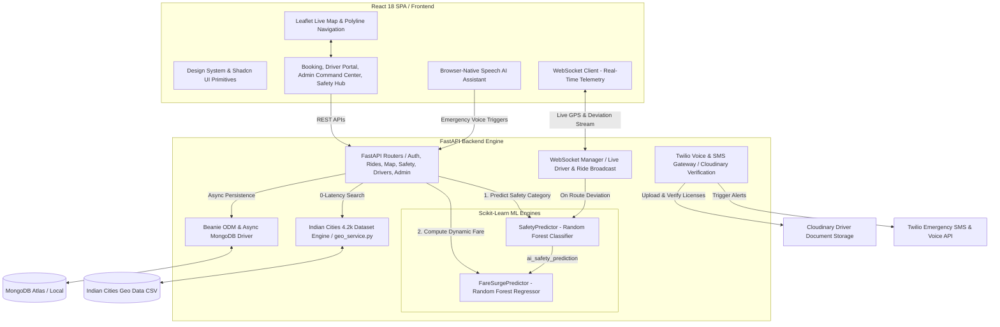

# 🛡️ SafeGo: Intelligent Ride Safety Platform & Geo-ML Engine

> A high-fidelity, safety-centric ride-sharing platform powered by real-time Machine Learning safety classifiers, dynamic fare surge regression models, live route deviation detection, multi-modal passenger safety policies, real-time OTP verification, and a 4.2k+ Indian Cities Geocoding Engine.

SafeGo pairs a modern, responsive **React 18 + TypeScript + TailwindCSS** web interface with an asynchronous **FastAPI** backend backed by **MongoDB (Beanie ODM)**, **Scikit-Learn Machine Learning Models**, **WebSockets**, and **Twilio Emergency Response**.

---

## 📑 Table of Contents
- [🏗️ System Architecture](#️-system-architecture)
- [🤖 Machine Learning & AI Integration](#-machine-learning--ai-integration)
- [🌟 Key Features & Innovations](#-key-features--innovations)
- [📁 Repository Structure](#-repository-structure)
- [⚡ Setup & Installation](#-setup--installation)
- [🧪 Testing & Quality Assurance](#-testing--quality-assurance)
- [📡 API & WebSocket Reference](#-api--websocket-reference)
- [📜 License](#-license)

---

## 🏗️ System Architecture

SafeGo uses a decoupled client-server architecture designed for low-latency telemetry, machine learning inference, real-time WebSocket communication, and emergency dispatching.



---

## 🤖 Machine Learning & AI Integration

SafeGo embeds dual Scikit-Learn models directly into its core routing and pricing pipeline:

```
backend/app/ml/
├── saved_models/
│   ├── safety_rf_model.joblib        # Trained Random Forest Safety Classifier (3.4 MB)
│   ├── safety_scaler.joblib          # StandardScaler for Geographical Features
│   ├── fare_surge_rf_model.joblib    # Trained Random Forest Surge Regressor (15.1 MB)
│   └── fare_surge_scaler.joblib      # StandardScaler for Surge Regressor
├── predictor.py                      # SafetyPredictor Singleton & Inference Engine
├── fare_predictor.py                 # FareSurgePredictor Singleton & Pricing Engine
├── train.py                          # Synthetic Dataset Generation & Safety Training
├── train_fare.py                     # Synthetic Dataset Generation & Surge Training
├── evaluate_safety_model.py          # Model Validation & Metrics Evaluation
├── test_inference.py                 # Safety Inference Unit Tests
└── test_fare_inference.py            # Fare Surge Inference Unit Tests
```

### 1. Geographical Safety Classifier (`predictor.py`)
- **Model**: `RandomForestClassifier` with balanced class weighting.
- **Output Classes**: `Stable` (Normal risk), `Cautious` (Moderate risk), `High Priority` (Elevated risk / emergency-ready).
- **Engineered Features**:
  - `pickup_hour`, `day_of_week`, `distance_km`, `passenger_count`, `ride_mode`.
  - `pickup_latitude`, `pickup_longitude`, `destination_latitude`, `destination_longitude`.
  - **Dynamic Haversine Features**: Real-time distance to safe urban hubs (`pickup_dist_to_safe_hub`, `dest_dist_to_safe_hub`) and distance to peripheral high-risk hotspots (`pickup_in_high_risk_hotspot`).
- **Real-time Pipeline**: Features are dynamically scaled using `safety_scaler.joblib` and processed with single-thread thread optimization (`n_jobs=1`) for sub-10ms response times.
- **Rule Fallback**: Deterministic spatial and temporal safety fallback if models are uninitialized.

### 2. Dynamic Fare Surge Regressor (`fare_predictor.py`)
- **Model**: `RandomForestRegressor`.
- **Output**: Continuous surge pricing multiplier between `1.0x` and `2.2x`.
- **Features**: Takes temporal factors (`pickup_hour`, `day_of_week`), ride parameters (`distance_km`, `passenger_count`, `ride_mode`), and crucially **the output of the Safety Classifier (`ai_safety_prediction`)**.

### 3. Backend Service Integration (`map_service.py`)
- **Route Calculation (`get_route`)**:
  1. Calls `predictor.predict_safety(...)` to evaluate route safety index.
  2. Passes the safety result to `fare_surge_predictor.predict_surge(...)` to determine pricing multiplier.
  3. Returns `fare_amount = round(base_fare * surge_multiplier, 2)` alongside the safety badge.
- **Live Route Deviation & Rerouting (`reroute_active_trip`)**:
  - Triggered via WebSocket telemetry whenever a driver deviates from the designated path.
  - Re-evaluates safety risk for the recalculated driver-to-destination corridor.

---

## 🌟 Key Features & Innovations

### 📍 1. 4.2k+ Indian Cities Geo Engine (`Indian Cities Geo Data.csv`)
- **Dataset**: 4,231 Indian cities, towns, and regions indexed across 34 States & Union Territories.
- **Instant Search API**: `GET /api/map/locations?q=...` provides zero-latency location search and coordinate resolution across India.
- **Interactive Routing Map**: Leaflet satellite map with automatic polyline decoding, maneuver instructions, and turn-by-turn steps.

### 🔑 2. Passenger 4-Digit Security PIN (OTP) Verification
- **Ride Start Protection**: Generates a unique 4-digit PIN for every booked ride (`[ 4 ] [ 8 ] [ 2 ] [ 9 ]`).
- **Driver Verification Console**: Drivers must enter the passenger's PIN in the **Driver Portal Active Console** (`POST /api/rides/{id}/verify-otp`). The backend strictly rejects status transitions to `in_progress` without OTP verification.

### 🚖 3. Dynamic Inclusive Ride Modes & Strict Policy Enforcement
- 🟢 **Normal Mode**: Standard high-speed ride-hailing.
- 🌸 **Pink Mode**: Specialized safety service catering exclusively to women passengers with verified female drivers.
  - *Backend Policy Enforcement*: Rejects solo male bookings; requires explicit accompanied female declaration.
- ♿ **PWD Mode**: Accessibility layout optimized for wheelchair assistance, high contrast, and keyboard navigation.
- 🟠 **Elderly Mode**: High-contrast, large-typography interface with caregiver emergency notification check-ins.
- 💎 **Premium Mode**: Executive travel mode with top-rated driver matching.

### 🚨 4. Real-Time Emergency SOS Response
- One-click and voice-triggered SOS transmitting live GPS coordinates, route polyline, and driver details.
- Dual escalation via **Twilio Voice Calls & SMS** to passenger emergency contacts and the **Admin Command Center**.
- WebSocket broadcasting for instant live tracking of distressed vehicles.

### 🗣️ 5. Browser-Native Speech AI Assistant
- Hands-free voice commands to trigger SOS, share live location, check ride status, or book rides.

### 🌐 6. Multilingual Support (6 Languages)
- Full internationalization support with English, Hindi (हिंदी), Spanish (Español), French (Français), Telugu (తెలుగు), and Tamil (தமிழ்).

---

## 📁 Repository Structure

```
Safe-Go/
├── Indian Cities Geo Data.csv        # 4,231 Indian cities dataset
├── backend/                         # FastAPI Backend Engine
│   ├── app/
│   │   ├── ml/                      # Scikit-Learn ML Models & Training Scripts
│   │   │   ├── saved_models/        # Pre-trained Random Forest models (.joblib)
│   │   │   ├── predictor.py         # Safety prediction engine
│   │   │   ├── fare_predictor.py    # Dynamic fare surge engine
│   │   │   ├── train.py             # Safety model training pipeline
│   │   │   └── train_fare.py        # Fare surge model training pipeline
│   │   ├── models/                  # Beanie ODM Models (User, Driver, Ride, SOSAlert)
│   │   ├── routes/                  # API Routers (Auth, Rides, Map, Drivers, Safety, WS)
│   │   ├── schemas/                 # Pydantic Request & Response Schemas
│   │   ├── services/                # Business Logic (map_service, geo_service, ride_service)
│   │   ├── utils/                   # Security, fare calculation, dependencies
│   │   └── main.py                  # FastAPI Application Entry & Lifespan
│   ├── tests/                       # Backend Integration & Unit Tests
│   ├── requirements.txt             # Python Dependencies
│   └── README.md                    # Backend Documentation
├── src/                             # React 18 Frontend SPA
│   ├── components/                  # UI Primitives & Design System (Shadcn UI)
│   ├── pages/                       # BookingPage, DriverPortal, AdminDashboard, Safety
│   ├── locales/                     # i18n Translation Dictionaries (6 Languages)
│   ├── services/                    # API & WebSocket Client Integrations
│   └── main.tsx                     # React Application Root
├── package.json                     # Frontend Dependencies & Scripts
├── tailwind.config.ts               # TailwindCSS Design System Configuration
└── vite.config.ts                   # Vite Build Configuration
```

---

## ⚡ Setup & Installation

### Prerequisites
- **Node.js** (v18.x or higher)
- **Python** (v3.10 or higher)
- **MongoDB** (Local instance or MongoDB Atlas cluster URI)

### 1. Environment Configuration
Create a unified `.env` file in the root directory:
```bash
cp .env.example .env
```
Configure your environment variables:
```env
# MongoDB Connection
DATABASE_URL=mongodb://localhost:27017/safego_db

# JWT Authentication
SECRET_KEY=your_super_secret_jwt_key_here
ACCESS_TOKEN_EXPIRE_MINUTES=1440

# Twilio Credentials (Optional for Emergency SMS/Voice)
TWILIO_ACCOUNT_SID=your_twilio_account_sid
TWILIO_AUTH_TOKEN=your_twilio_auth_token
TWILIO_PHONE_NUMBER=your_twilio_phone_number

# Cloudinary (Driver Verification Documents)
CLOUDINARY_CLOUD_NAME=your_cloud_name
CLOUDINARY_API_KEY=your_api_key
CLOUDINARY_API_SECRET=your_api_secret
```

### 2. Backend Setup
```bash
# Navigate to backend directory
cd backend

# Create and activate virtual environment
python -m venv venv

# Windows:
.\venv\Scripts\activate
# Linux/macOS:
source venv/bin/activate

# Install dependencies
pip install -r requirements.txt

# (Optional) Retrain or evaluate ML models
python app/ml/train.py
python app/ml/train_fare.py

# Start the FastAPI backend server
uvicorn app.main:app --reload --host 0.0.0.0 --port 8000
```

### 3. Frontend Setup
```bash
# Open a new terminal from repository root
npm install

# Start Vite development server
npm run dev
```

Application URLs:
- **Frontend App**: [http://localhost:8080](http://localhost:8080)
- **Backend API & Swagger Docs**: [http://localhost:8000/docs](http://localhost:8000/docs)

---

## 🧪 Testing & Quality Assurance

SafeGo includes automated test suites covering both frontend components and backend services:

### 1. Frontend Test Suite (Vitest & RTL)
```bash
# Run unit & integration tests
npm test

# Run tests with interactive UI
npm run test:ui

# Generate coverage report
npm run test:coverage
```

### 2. Backend Test Suite (Pytest)
```bash
cd backend
python -m pytest test_all_safego.py
python -m pytest test_integration_safego.py
python -m pytest test_e2e_sos_regression.py
python -m pytest app/ml/test_inference.py
python -m pytest app/ml/test_fare_inference.py
```

---

## 📡 API & WebSocket Reference

### Core Endpoints

| Method | Endpoint | Description |
|---|---|---|
| `POST` | `/api/auth/register` | User/Driver registration with role assignment |
| `POST` | `/api/auth/login` | JWT OAuth2 authentication |
| `GET` | `/api/map/locations?q=` | Indian Cities 4.2k location search |
| `POST` | `/api/map/route` | Routing, ML safety prediction & dynamic surge pricing |
| `POST` | `/api/map/reroute` | Real-time dynamic rerouting with AI risk re-evaluation |
| `POST` | `/api/rides` | Ride booking and fare lock |
| `POST` | `/api/rides/{id}/verify-otp` | 4-Digit OTP verification to start trip |
| `POST` | `/api/safety/sos` | Trigger emergency SOS (Twilio SMS/Call + Admin alert) |
| `GET` | `/api/drivers/profile` | Driver profile, certification, and stats |

### Real-Time WebSockets

- `WS /ws/driver/{driver_id}`: Real-time driver GPS telemetry & route deviation detection.
- `WS /ws/ride/{ride_id}`: Live trip tracking broadcast to passenger.
- `WS /ws/admin/live`: Live command center monitoring for all active vehicles and alerts.

---

## 📜 License

This project is licensed under the **MIT License**.
