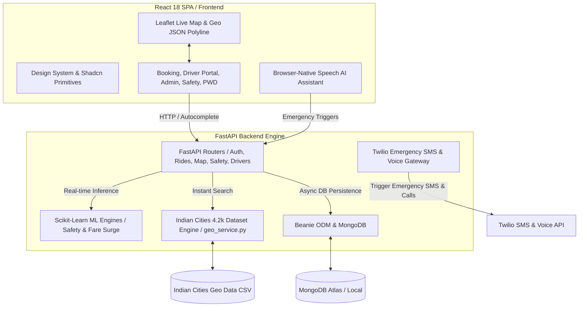

# 🛡️ SafeGo: Intelligent Ride Safety Platform & Geo-ML Engine

> A premium, high-fidelity, and safety-centric ride-sharing platform powered by Machine Learning safety predictions, dynamic fare surge algorithms, real-time OTP verification, and a 4.2k+ Indian Cities Geocoding Engine.

SafeGo combines a modern, high-performance web frontend built on **React 18, TypeScript, and TailwindCSS** with an asynchronous **FastAPI** backend backed by **MongoDB (Beanie ODM)**, **Scikit-Learn Machine Learning Models**, and **Twilio Emergency Response**.

---

## 🏗️ Architecture Overview

SafeGo utilizes a decoupled client-server architecture designed for real-time telemetry, machine learning inference, low latency, and safety-oriented dispatching.



---

## 🌟 Key Features & Innovations

### 🤖 1. Machine Learning Safety & Surge Engine
- **Safety Predictor (`predictor.py`)**: Uses a trained **Random Forest Classifier** (`safety_rf_model.joblib`) to predict real-time safety scores, risk factors, and safety categories based on distance, time of day, and location risk profiles.
- **Dynamic Fare Surge Predictor (`fare_predictor.py`)**: Trained Random Forest model (`fare_surge_rf_model.joblib`) calculating dynamic fare multipliers based on ride mode, safety index, time, and distance.

### 📍 2. 4.2k+ Indian Cities Geo Engine (`Indian Cities Geo Data.csv`)
- **Indexed Dataset**: 4,231 Indian cities, towns, and regions indexed across 34 Indian States & Union Territories.
- **Instant Search API**: Exposed via `GET /api/map/locations?q=...` for 0-latency location search and accurate coordinate resolution across India.
- **Destination-Gated Interactive Map**: Leaflet satellite map automatically locks navigation and renders exact route polylines as soon as the user enters their destination.

### 🔑 3. Passenger 4-Digit Security PIN (OTP) Verification
- **Ride Start Security**: Generates a unique 4-digit PIN for every booked ride (`[ 4 ] [ 8 ] [ 2 ] [ 9 ]`).
- **Driver Verification Modal**: Drivers must enter the passenger's PIN in the **Driver Portal Active Console** to start the trip (`POST /api/rides/{id}/verify-otp`). Direct status transition to `in_progress` without OTP is strictly blocked by the backend.

### ⚡ 4. Instant Cab Auto-Match & One-Click Booking
- **Auto-Matching**: Automatically matches the user with the nearest verified fleet driver.
- **Fleet Management**: Pre-seeded Indian driver profiles (`priya.singh@safego.in`, `vihaan.gupta@safego.in`, `kabir.khan@safego.in`, etc.) certified across standard, female-only, elderly, and accessibility modes.

### 🚖 5. Dynamic Inclusive Ride Modes
- 🟢 **Normal Mode**: Standard high-speed ride-hailing.
- 🌸 **Pink Mode**: Specialized safety service catering exclusively to women passengers with verified female drivers.
- ♿ **PWD Mode**: Accessibility layout optimized for wheelchair assistance, high contrast, and keyboard navigation.
- 🟠 **Elderly Mode**: High-contrast, large-typography interface with caregiver emergency notification check-ins.

### 🚨 6. Real-Time Emergency SOS Response
- Transmits live GPS coordinates, route polyline, and driver details to emergency contacts via **Twilio Voice Calls & SMS** and broadcasts alerts to the **Admin Command Center**.

---

## 📁 Repository Structure

```
Safe-Go/
├── Indian Cities Geo Data.csv # 4,231 Indian cities dataset
├── backend/                  # FastAPI Backend Engine
│   ├── app/
│   │   ├── ml/               # Scikit-Learn ML Models & Training Scripts
│   │   │   ├── saved_models/ # Trained Random Forest models (.joblib)
│   │   │   ├── predictor.py  # Safety prediction engine
│   │   │   └── fare_predictor.py # Dynamic fare surge engine
│   │   ├── models/           # Beanie ODM Models (User, Driver, Ride, SOSAlert)
│   │   ├── routes/           # API Routers (Auth, Rides, Map, Drivers, Safety)
│   │   ├── services/         # Business Logic (geo_service.py, ride_service.py)
│   │   └── main.py           # FastAPI Application Entry
│   ├── .env.example          # Backend Environment Template
│   └── requirements.txt      # Python dependencies
├── src/                      # React 18 Frontend SPA
│   ├── components/           # UI Primitives & Design System (Shadcn UI)
│   ├── pages/                # BookingPage, DriverPortal, AdminDashboard, Safety
│   ├── locales/              # i18n Translation Dictionaries (6 Languages)
│   └── main.tsx              # React Entry & Provider Wrappers
├── .env.example              # Frontend Environment Template
└── package.json              # NPM Dependencies
```

---

## ⚡ Setup & Installation

### Prerequisites
- **Node.js** (v18.x or higher)
- **Python** (v3.10 or higher)
- **MongoDB** (Local instance or MongoDB Atlas cluster)

### 1. Backend Setup
```bash
# Navigate to backend folder
cd backend

# Create virtual environment
python -m venv venv

# Activate virtual environment
# Windows:
.\venv\Scripts\activate
# Linux/macOS:
source venv/bin/activate

# Install dependencies
pip install -r requirements.txt

# Copy environment template
cp .env.example .env

# Start FastAPI server
python -m uvicorn app.main:app --port 8000 --reload
```

### 2. Frontend Setup
```bash
# From the root directory:
npm install

# Copy environment template
cp .env.example .env

# Start Vite dev server
npm run dev
```

Access the application at [http://127.0.0.1:8080](http://127.0.0.1:8080).

---

## 📜 Git Commit Structure

The project history is cleanly structured into 8 modular commits:
1. `setup project configuration and build pipeline`
2. `add UI design system and Shadcn component primitives`
3. `implement internationalization (i18n) and multilingual translation resources`
4. `add core pages, navigation bar, and application routes`
5. `implement FastAPI backend infrastructure, authentication, and database schemas`
6. `integrate Machine Learning Random Forest models for Safety Prediction and Fare Surge Pricing`
7. `implement Passenger OTP verification, Driver Active Console, and instant cab booking workflow`
8. `add 4.2k Indian Cities Geo dataset and real-time location search engine`
